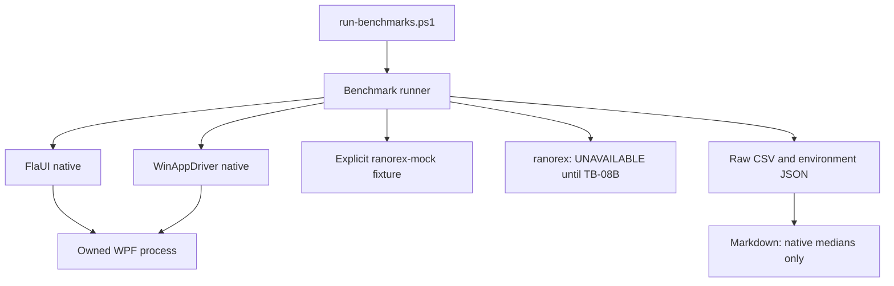

# Benchmark harness and explicit mock (TB-08A)

TB-08 was split with user approval on 2026-09-21. Stage A delivers the runner,
real measurements from available adapters, and mock plumbing. Stage B delivers
the licensed Ranorex adapter, unchanged BDD acceptance and genuine three-driver
comparison. Stage A does not close the original native Ranorex requirement.



## Run commands

Use PowerShell 7 on Windows with .NET 9, from this repository. Close interactive
SUT instances and run desktop automation sequentially.

```powershell
# Real FlaUI observations, mock routing, and an explicitly unavailable native row.
./scripts/run-benchmarks.ps1 -Drivers flaui,ranorex-mock,ranorex -AllowUnavailable

# Require all requested native engines; missing prerequisites fail with a report.
./scripts/run-benchmarks.ps1 -Drivers flaui,winappdriver,ranorex

# With the documented WinAppDriver prerequisites, own the servers, pass BDD,
# then measure both native adapters before the finally block stops the servers.
./scripts/run-bdd.ps1 -Driver winappdriver -Benchmark
```

WinAppDriver provisioning is documented in [protocol parity](winappdriver-parity.md).
The standalone benchmark command only uses already running loopback servers;
it never stops servers it did not start. The BDD wrapper owns its servers.

Optional `-Repetitions` (default 3), `-Lookups` (20) and `-Warmups` (1) configure
the same operation sequence for each engine. Each warmup and measured repetition
creates a new adapter and SUT process. Warmups stay in the raw CSV but are excluded
from medians. Native adapters close their owned processes in a finally block;
cleanup failures invalidate that engine's summary and fail the command.

## Measurement definitions

| Field | Definition | Limit |
|---|---|---|
| Startup ms | Adapter launch through first verified enabled blotter grid, including PID capture | Fresh process, not a cold OS/disk cache; server startup and build excluded |
| Lookup mean ms | Repeated grid AutomationId lookup plus AutomationId/enabled validation, divided by lookup count | Measures the shared contract operation, not a bare vendor API call |
| SUT working set MiB | One `WorkingSet64` snapshot after lookup | Excludes runner/proxy/server memory; not peak memory or allocation rate |

The ordinary SUT ticker remains enabled. Engines run in selected order, on an
uncontrolled desktop. These are descriptive observations, not statistically
controlled rankings. Do not compare different machines, runner images, executable
hashes or settings as if they were paired measurements. The WinAppDriver job
measures both native adapters sequentially on the same runner; the separate
default gate and local runs are different environments. No three-driver
performance claim exists.

## Evidence and failure semantics

Each invocation creates a new `TestResults/benchmarks/<id>/` directory (or the
supplied `-Output`). Existing directories are rejected to preserve evidence.

- `metadata.json`: UTC time, revision (with `-dirty` when appropriate), OS/runtime,
  architecture, CPU count, interactive state, hosted image/run, selected drivers,
  repetitions, lookup count, warmups and SUT SHA-256.
- `samples.csv`: every warmup and measured attempt, status, PID, timing, memory
  and error detail; also records cleanup failures.
- `report.md`: native-only medians and explicit mock/unavailable/error rows.

`ranorex-mock` implements only in-memory launch, grid lookup and cleanup. Other
desktop operations throw. It does not reference Ranorex assemblies, launch WPF,
run BDD or acquire a licence. Its timing and memory fields are blank, even though
the runner exercises the same reporting path. It is never an automatic fallback.

`ranorex` always records `UNAVAILABLE` until Stage B supplies a native adapter.
Missing WinAppDriver status endpoints also produce `UNAVAILABLE`; an execution
failure after availability checking is an `ERROR`, never a mock result. The CLI
returns 0 for success, 1 for execution/configuration errors, and 2 for unavailable
engines. `-AllowUnavailable` permits only the unavailable state; errors still fail.
The PowerShell wrapper throws for non-zero CLI results, retaining the reports.

The default CI gate runs 12 harness tests plus the existing 74 tests, followed by
FlaUI/mock/unavailable observations. The WinAppDriver job runs the same ten BDD
scenarios and then both native adapters, mock and unavailable observations.
Both jobs retain reports as artifacts.

## Native Ranorex prerequisite (TB-08B)

The [vendor API setup](https://api-manual.ranorex.com/en-US/getting-started/basic-setup.html)
requires a Ranorex installation, licence and .NET Framework host. No SDK was found
in the standard installation directories, uninstall registry or Ranorex environment
settings during preflight. The current shared contract targets .NET 9. Validate
runtime compatibility with the supplied SDK before choosing shared targeting or
an out-of-process bridge; neither design is claimed implemented here.

## Stage A acceptance: 2026-09-21

PR #12 merged implementation `9acd5b2` as
`0f09e209c1e75d571e53d92abb5aba96858028fe`. Both pre-merge runs
[35580277957](https://github.com/GBrooks1970/tradeblotter-wpf-screenplay/actions/runs/35580277957)
and [35580283543](https://github.com/GBrooks1970/tradeblotter-wpf-screenplay/actions/runs/35580283543)
passed. The [post-merge main run 35581840286](https://github.com/GBrooks1970/tradeblotter-wpf-screenplay/actions/runs/35581840286)
also passed all 86 default tests (29 framework, 34 Screenplay, 10 FlaUI BDD,
1 native smoke, 12 harness), 10 unchanged WinAppDriver BDD scenarios, and both
native benchmark paths.

The paired hosted run used one warmup followed by three measured fresh processes
per adapter, with 20 verified grid lookups per repetition. Its captured medians:

| Adapter | Startup ms | Lookup mean ms | SUT working set MiB |
|---|---:|---:|---:|
| FlaUI | 730.4654 | 151.3618 | 108.8828 |
| WinAppDriver | 3896.3263 | 1059.5089 | 110.6719 |

These observations are archived unchanged in the [generated report](benchmarks/2026-09-21_tb08a-main-35581840286/report.md),
[raw CSV](benchmarks/2026-09-21_tb08a-main-35581840286/samples.csv) and
[environment metadata](benchmarks/2026-09-21_tb08a-main-35581840286/metadata.json).
Mock repetitions have blank metric fields; native Ranorex is UNAVAILABLE.
The definitions and comparison limits above still apply. This completes TB-08A,
not native Ranorex or the original three-driver requirement.
