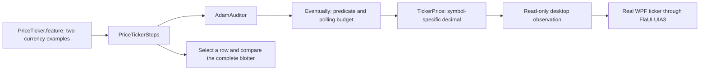

# Walkthrough — TB-06 ticker verification and TB-05 reconciliation

## Executive Summary

TB-06 now verifies repeating EUR/USD and GBP/USD prices against the real WPF application using condition-driven Screenplay observations. All 61 tests passed locally and in both hosted runs for implementation commit `e1ef4ea2b49228295c375a60a0873e6298a5a92a`; project PR #10 remains open for review. The preceding root worklist update was merged through root PR #215, and project PR #9 was subsequently confirmed merged before TB-06 began. This record captures that completed implementation and its acceptance evidence, with the new root worklist reconciliation left separate and uncommitted.

## 1. Changes Implemented

### Screenplay observations and executable scenarios

The SUT already alternates two fixed ticker strings using its UI dispatcher. This batch adds verification without changing the application timer, feed values or business logic.



| File | Change and purpose |
|---|---|
| [src/TradeBlotter.Screenplay/Questions/Eventually.cs](D:/_CLAUDE_COWORK/PROJ001/claude-outputs/test-automation-portfolio/tradeblotter-wpf-screenplay/src/TradeBlotter.Screenplay/Questions/Eventually.cs) | New generic question decorator: immediate observation, predicate-driven polling on the caller's thread, remaining-budget delays, propagated errors and diagnostic timeouts. |
| [src/TradeBlotter.Screenplay/Questions/TickerPrice.cs](D:/_CLAUDE_COWORK/PROJ001/claude-outputs/test-automation-portfolio/tradeblotter-wpf-screenplay/src/TradeBlotter.Screenplay/Questions/TickerPrice.cs) | New symbol-specific decimal observation; rejects absent, duplicated or malformed quotes and parses invariantly. |
| [tests/TradeBlotter.Specs/Features/PriceTicker.feature](D:/_CLAUDE_COWORK/PROJ001/claude-outputs/test-automation-portfolio/tradeblotter-wpf-screenplay/tests/TradeBlotter.Specs/Features/PriceTicker.feature) | Two examples require first value, alternate value and return value for EUR/USD and GBP/USD, rather than merely checking static text. |
| [tests/TradeBlotter.Specs/Steps/PriceTickerSteps.cs](D:/_CLAUDE_COWORK/PROJ001/claude-outputs/test-automation-portfolio/tradeblotter-wpf-screenplay/tests/TradeBlotter.Specs/Steps/PriceTickerSteps.cs) | Composes Screenplay questions with five-second/100 ms polling, compares the whole blotter and verifies selection after the cycle. No native UI calls in steps. |
| [tests/TradeBlotter.Screenplay.Tests/TickerScreenplayTests.cs](D:/_CLAUDE_COWORK/PROJ001/claude-outputs/test-automation-portfolio/tradeblotter-wpf-screenplay/tests/TradeBlotter.Screenplay.Tests/TickerScreenplayTests.cs) | Fourteen new cases covering symbol parsing under fr-FR culture, malformed/absent/duplicate quotes, immediate/eventual matches, thread identity, timeout diagnostics, error propagation and invalid configuration. |
| [tests/TradeBlotter.Screenplay.Tests/ScreenplayTests.cs](D:/_CLAUDE_COWORK/PROJ001/claude-outputs/test-automation-portfolio/tradeblotter-wpf-screenplay/tests/TradeBlotter.Screenplay.Tests/ScreenplayTests.cs) | Makes the existing fixture partial so new cases share its in-memory driver; existing cases are retained. |

Before, the suite had placement and cancellation coverage but no observation of a complete ticker cycle. The new composition uses an explicit condition instead of a fixed wait:

```csharp
var actual = session.Auditor.AsksFor(new Eventually<decimal>(new TickerPrice(symbol),
    price => price == expected, TimeSpan.FromSeconds(5), TimeSpan.FromMilliseconds(100),
    $"{symbol} price {value}"));
```

The predicate receives a fresh observation on each poll. An exception from the underlying question or predicate is not converted into a retry, so malformed data cannot masquerade as a slow feed. The timing budget bounds polling, not an individual blocking UIA/COM call; the existing test-host timeout remains the outer safeguard.

### Gate, documentation and control state

| File | Change and purpose |
|---|---|
| [scripts/verify-ci.ps1](D:/_CLAUDE_COWORK/PROJ001/claude-outputs/test-automation-portfolio/tradeblotter-wpf-screenplay/scripts/verify-ci.ps1) | Raises exact expected counts from 20 to 34 Screenplay tests and 8 to 10 BDD examples; total from 45 to 61. Framework/native counts remain 16 and 1. |
| [README.md](D:/_CLAUDE_COWORK/PROJ001/claude-outputs/test-automation-portfolio/tradeblotter-wpf-screenplay/README.md) | Adds ticker coverage and its guide; updates the current gate total and remaining work. |
| [CHANGELOG.md](D:/_CLAUDE_COWORK/PROJ001/claude-outputs/test-automation-portfolio/tradeblotter-wpf-screenplay/CHANGELOG.md) | Records the TB-06 delivery while retaining historical TB-04/TB-05 entries. |
| [docs/backlog.md](D:/_CLAUDE_COWORK/PROJ001/claude-outputs/test-automation-portfolio/tradeblotter-wpf-screenplay/docs/backlog.md) | Moves Risk #6 to COMPLETE after local and hosted acceptance; version 7 leaves two MEDIUM items, estimated 12–16 hours. |
| [docs/price-ticker-bdd.md](D:/_CLAUDE_COWORK/PROJ001/claude-outputs/test-automation-portfolio/tradeblotter-wpf-screenplay/docs/price-ticker-bdd.md) | New reproduction guide, exact price cycles, polling semantics, evidence and limits on assurance claims. |
| [docs/project-contract.md](D:/_CLAUDE_COWORK/PROJ001/claude-outputs/test-automation-portfolio/tradeblotter-wpf-screenplay/docs/project-contract.md) | Updates current counts and extends the desktop gate to ticker questions. |
| [docs/screenplay-core.md](D:/_CLAUDE_COWORK/PROJ001/claude-outputs/test-automation-portfolio/tradeblotter-wpf-screenplay/docs/screenplay-core.md) | Distinguishes explicit observation polling from retrying failed interactions; documents the new questions. |
| [docs/windows-ci.md](D:/_CLAUDE_COWORK/PROJ001/claude-outputs/test-automation-portfolio/tradeblotter-wpf-screenplay/docs/windows-ci.md) | Updates the current gate to 61 tests while retaining the labelled 36-test TB-04 acceptance record. |
| [docs/order-cancellation-bdd.md](D:/_CLAUDE_COWORK/PROJ001/claude-outputs/test-automation-portfolio/tradeblotter-wpf-screenplay/docs/order-cancellation-bdd.md) | Labels its 45-test record as the TB-05 baseline and links the subsequently delivered ticker coverage. |
| [src/TradeBlotter.Sut/README.md](D:/_CLAUDE_COWORK/PROJ001/claude-outputs/test-automation-portfolio/tradeblotter-wpf-screenplay/src/TradeBlotter.Sut/README.md) | Updates the pedagogical coverage table to point to the two ticker scenarios. |
| [WORKLIST_tradeblotter-wpf-screenplay.md](D:/_CLAUDE_COWORK/PROJ001/claude-outputs/test-automation-portfolio/WORKLIST_tradeblotter-wpf-screenplay.md) | Root PR #215 recorded validated TB-05 delivery while project PR #9 was still open. The new uncommitted reconciliation records PR #9's actual merge and TB-06 delivery; it is outside the project PR. |
| [This immutable walkthrough](D:/_CLAUDE_COWORK/PROJ001/claude-outputs/test-automation-portfolio/tradeblotter-wpf-screenplay/docs/walkthroughs/2026-09-20_tb06-ticker-verification.md) | New dated record; the earlier foundation walkthrough is preserved. |

The exact-count gate changes deliberately with the new coverage:

```text
Before: framework 16 + Screenplay 20 + BDD 8 + native 1 = 45
After:  framework 16 + Screenplay 34 + BDD 10 + native 1 = 61
```

No source files were deleted. The project implementation file inventory was checked with `git diff --name-status de928d3..e1ef4ea`; the backlog closure, evidence paragraph and this record form the documentation follow-up.

## 2. Verification & Test Evidence

Local evidence was captured on 2026-09-20 by `./scripts/verify-ci.ps1` in PowerShell 7, from the project root. The test commands below include the suite-identifying arguments; the script also sets TRX destinations, normal console logging and a 90-second hang timeout. Local timings are console-reported test-run durations, not benchmark results.

| Command | Quality Gate / Suite | Status | Metrics (Passed/Total) | Duration |
|---|---|---|---|---|
| `dotnet build <project> --configuration Release --no-restore` for all seven script-listed projects | SUT, probe, framework, Screenplay and three test projects | PASS | 7/7; each 0 warnings and 0 errors | 3.53, 1.78, 1.36, 1.89, 2.02, 3.62, 5.06 s respectively; sum 19.26 s, excluding restores |
| `dotnet test tests/TradeBlotter.Framework.Tests/TradeBlotter.Framework.Tests.csproj -c Release --no-build --no-restore --filter FullyQualifiedName~DriverTests` | Framework | PASS | 16/16 | 2.0073 s |
| `dotnet test tests/TradeBlotter.Screenplay.Tests/TradeBlotter.Screenplay.Tests.csproj -c Release --no-build --no-restore --filter FullyQualifiedName~ScreenplayTests` | Screenplay | PASS | 34/34 | 1.4979 s |
| `dotnet test tests/TradeBlotter.Specs/TradeBlotter.Specs.csproj -c Release --no-build --no-restore --filter FullyQualifiedName~TradeBlotter.Specs.Features` | Real-WPF BDD: 4 placement, 4 cancellation, 2 ticker | PASS | 10/10 | 47.2825 s |
| `dotnet test tests/TradeBlotter.Framework.Tests/TradeBlotter.Framework.Tests.csproj -c Release --no-build --no-restore --filter FullyQualifiedName~DesktopSmokeTests` | Native integration; script sets `TRADEBLOTTER_SUT` | PASS | 1/1 | 10.4384 s |
| `git diff --check` and relative-link resolution | Documentation | PASS before implementation commit | No whitespace errors or broken checked links | Not timed |
| `gh pr checks 10` | Hosted push [35480734919](https://github.com/GBrooks1970/tradeblotter-wpf-screenplay/actions/runs/35480734919) | PASS | 61/61; attempt 1 | 2m20s job duration |
| `gh pr checks 10` | Hosted PR [35480747091](https://github.com/GBrooks1970/tradeblotter-wpf-screenplay/actions/runs/35480747091) | PASS | 61/61; attempt 1 | 2m29s job duration |

All test totals above have zero failures and zero skips. The hosted PR log separately reports framework 1.2294 s, Screenplay 1.0775 s, BDD 28.9803 s and native 7.4266 s. Its job ran from `2026-09-20T01:11:37Z` to `2026-09-20T01:14:06Z`. It checked out merge preview `714630fb4a8afaf9e59932cb90452bd638a5cbf8`, based on source head `e1ef4ea2b49228295c375a60a0873e6298a5a92a`; the push run tested the source head directly.

Captured local output:

```text
VERIFIED framework: 16/16 passed
VERIFIED screenplay: 34/34 passed
VERIFIED bdd: 10/10 passed
VERIFIED native: 1/1 passed
PASS: 61 tests, four TRX reports, no remaining SUT process.
```

Captured PR check output:

```text
Build and verify WPF desktop  pass  2m20s  .../actions/runs/35480734919/job/105997939445
Build and verify WPF desktop  pass  2m29s  .../actions/runs/35480747091/job/105997971821
```

The ellipses abbreviate only the repository URL prefix; the full run URLs are linked above. Local raw output remains in ignored `TestResults/tb06-validation.log`; downloaded hosted output is in ignored `TestResults/tb06-hosted-pr.log` and `TestResults/tb06-hosted-push.log`. Hosted jobs retain TRX artifacts under the existing seven-day retention policy. This walkthrough preserves the numeric summary independently of those temporary files. No dependency audit was performed in this batch, and no zero-vulnerability claim is made.

## 3. Operational State & Invariants

- Project branch: `codex/tb-06-price-ticker`. At implementation commit `e1ef4ea`, the checkout was clean and `git rev-list --left-right --count HEAD...origin/codex/tb-06-price-ticker` returned `0 0`. This walkthrough and backlog closure are a subsequent documentation commit; their publication/check status is reported by [PR #10](https://github.com/GBrooks1970/tradeblotter-wpf-screenplay/pull/10).
- Project [PR #9](https://github.com/GBrooks1970/tradeblotter-wpf-screenplay/pull/9) was verified merged at `2026-09-20T01:05:52Z` as `de928d3f53c8be8d17feb5bde1c4d73f2f6078bb`. TB-06 branched from that up-to-date default branch, so it does not republish TB-05 as new work.
- Root [PR #215](https://github.com/GBrooks1970/test-automation-portfolio/pull/215) merged at `2026-09-20T01:04:47Z` as `87be9d0751a2f727448b63a29245a50f7f1f6427`. The root checkout was fast-forwarded to that commit. The later TB-05 merge/TB-06 completion worklist diff is deliberately uncommitted support-repository control state.
- GitHub showed PR #9 open during the preceding root publication despite the initial merge report; root PR #215 retained the observed awaiting-merge status. The later verified merge is now reconciled in the new root diff rather than inventing an earlier merge.
- The latest project handover is still v1 and predates TB-01–TB-06 deliveries. The current backlog and verified repository history are authoritative; the old handover is not silently rewritten.
- UI observations remain sequential, step definitions contain no native driver calls, and the default driver is FlaUI.UIA3. No paid driver, external daemon or Docker service was introduced. The SUT uses a UI-dispatcher mock feed; these results do not establish an external feed, exact tick timing or general immunity to COM deadlocks.
- Only TB-06 was implemented in this iteration. TB-07 and TB-08 remain open. Documentation uses en-GB; the sole diagram is Mermaid. This is the durable project walkthrough; no Antigravity brain artifact applies in the Codex environment.

## 4. Recommended Next Actions

1. **Recommended:** review and merge project PR #10 after its final documentation checks pass.
2. Publish the separate root worklist reconciliation through the root branch/PR flow when authorised, recording the eventual TB-06 merge accurately.
3. Begin TB-07, the WinAppDriver adapter and parity item, in a separate iteration; reassess its prerequisites before implementation.
4. Refresh the versioned session handover at the next session boundary because v1 no longer describes the delivered framework, suites or CI gates.
