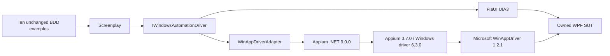

# WinAppDriver protocol parity (TB-07)

The optional adapter implements the same driver contract as FlaUI. Driver choice
is confined to the BDD fixture's composition boundary: feature files, bindings,
Screenplay tasks and questions are unchanged. The default remains FlaUI.



Modern [Appium .NET](https://github.com/appium/dotnet-client#winappdriver-notice)
uses W3C WebDriver. WinAppDriver's legacy protocol requires the
[Appium Windows proxy](https://github.com/appium/appium-windows-driver).
This verifies interoperability through that proxy; it does not claim that the
Microsoft server itself implements modern W3C WebDriver. Microsoft WinAppDriver
is no longer actively maintained, so FlaUI remains the default.

## Running the suite

Use Windows, PowerShell 7 and .NET 9. For WinAppDriver additionally install Node 24,
[Microsoft WinAppDriver 1.2.1](https://github.com/microsoft/WinAppDriver/releases/tag/v1.2.1)
at its default location and enable Windows Developer Mode. These machine settings
are manual prerequisites on personal workstations.

```powershell
npm ci --ignore-scripts --prefix tools/winappdriver
./scripts/run-bdd.ps1 --driver=flaui
./scripts/run-bdd.ps1 --driver=winappdriver
```

Run desktop suites sequentially. The script refuses occupied ports, starts its
own WinAppDriver on `127.0.0.1:4724` and Appium on `127.0.0.1:4723`, registers the
locked local Windows driver in a fresh isolated Appium home, and waits for both
status endpoints. It always stops its owned process trees, including on failure.
It never attaches to or kills an existing automation server.

Each scenario asks WinAppDriver to launch its SUT using the standard `app`
capability. The adapter rejects an existing exact-path instance, tracks the newly
launched process and checks its identity against the session root. Desktop suites
must run serially; multiple matching processes are an ownership error. Teardown closes the session and the owned application,
with a bounded forced exit fallback. Element wrappers reject use after their
session closes. Disabled elements reject interactions. Scenario teardown checks
that the owned SUT exited. Window and element lookup poll within bounded waits.

The earlier HWND-attachment approach left later SUT windows behind the runner
console despite reported focus. Application creation now belongs to WinAppDriver;
the adapter does not alter topmost flags or join another application's input queue.

Element-relative XPath is anchored to the element's native RuntimeId in the
session tree. Passing the shared `./*` expressions directly to WinAppDriver's
element endpoint returned no blotter rows, despite successful grid discovery.
The translation preserves the caller's scope without changing the shared queries.

`TRADEBLOTTER_DRIVER` can also select the fixture for direct `dotnet test` runs;
the script sets and restores it automatically. Unknown values fail immediately.
Direct WinAppDriver runs require both servers to be provisioned separately.

## Reproducibility and evidence

The [separate CI job](../.github/workflows/ci.yml) uses a fresh GitHub-hosted Windows
runner. Its [setup script](../scripts/setup-winappdriver-ci.ps1) refuses personal
or self-hosted environments, verifies the Microsoft MSI SHA-256 and signature,
installs it, and enables Developer Mode only on that disposable machine.
MSI SHA-256: `A76A8F4E44B29BAD331ACF6B6C248FCC65324F502F28826AD2ACD5F3C80857FE`.

NuGet and npm direct versions are pinned. The npm lockfile includes a `morgan`
1.12.0 override to resolve the upstream log-forging advisory; `npm audit` reports
zero vulnerabilities on 2026-09-20. The proxy only listens on loopback.

Each BDD invocation produces a new ignored `TestResults/<driver>/<run-id>/`
directory. Exactly ten discovered, executed and passed scenarios are required;
skips or missing reports fail the gate. CI retains TRX and server logs for seven
days, including per-session UI trees and screenshots captured before teardown.
The default FlaUI gate also executes thirteen non-UI WinAppDriver endpoint
and lifecycle cases, bringing its total to 74 tests.

Hosted WinAppDriver acceptance is pending. Local Developer Mode was unavailable;
local validation covers compilation, endpoint/lifecycle tests and FlaUI regression.

The initial hosted runs exposed relative XPath behaviour and console occlusion.
[Run 35526425875](https://github.com/GBrooks1970/tradeblotter-wpf-screenplay/actions/runs/35526425875)
passed the first native scenario but failed the other nine; its screenshots
distinguished console occlusion from an element-location or assertion error.
These failed runs are diagnostic evidence, not acceptance evidence.
