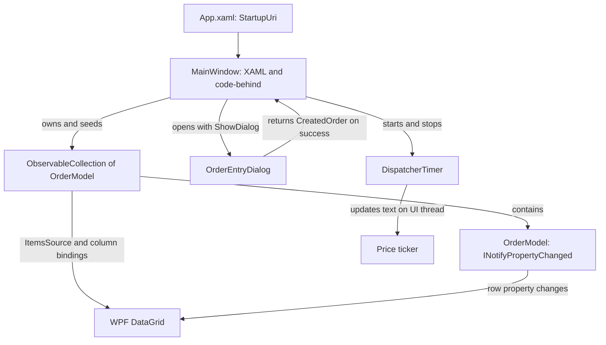
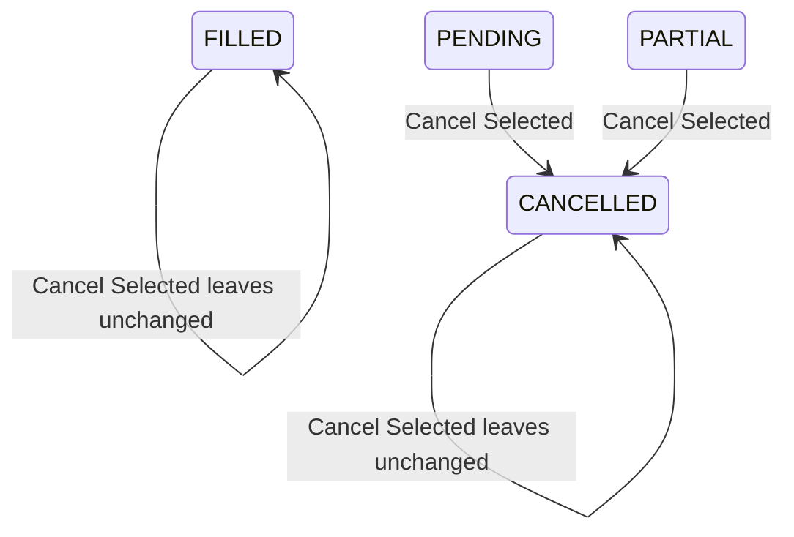

# TradeBlotter.Sut — a desktop application for learning automation

TradeBlotter.Sut is the **system under test (SUT)**: a small Windows Presentation
Foundation (WPF) application that simulates a foreign-exchange trading desk.
A *blotter* is a table of orders and their current state. Here, that familiar
business workflow provides a concrete way to learn desktop automation: find a
control, open a modal window, enter data, handle validation and observe a row change.

The application runs independently of the automation framework. It has no broker
connection, database, live market feed or trade-execution service. Its repeatable
starting data makes assertions understandable, while real WPF controls expose the
window, binding and timing behaviour that desktop tests need to handle.

## Run and explore

Use Windows with the .NET 9 SDK and an available desktop. From the **repository
root** (the directory containing the [project README](../../README.md)), run:

```powershell
dotnet build src/TradeBlotter.Sut/TradeBlotter.Sut.csproj --configuration Release
dotnet run --project src/TradeBlotter.Sut/TradeBlotter.Sut.csproj --configuration Release --no-build
```

The [project file](TradeBlotter.Sut.csproj) targets `net9.0-windows`, enables WPF
and produces a `WinExe`. It has no package references or dependency on FlaUI,
Screenplay or Reqnroll. Those belong to the automation projects.

Try this short exercise:

1. Start the application. Observe four seeded orders and the changing ticker.
2. Select **+ New Order**. Keep `EUR/USD` and `LIMIT`, enter quantity `250000`
   and price `1.0850`, then submit. The new first row is `ORD-2026-0905`,
   `BUY`, `PENDING`, with zero filled quantity; the total becomes five.
3. Open another order and submit quantity `0`. A **Validation Error** message
   appears. Dismiss it and select **Cancel** in the entry dialog; no row is added.
4. Select the seeded `ORD-2026-0902` row and choose **Cancel Selected**. Its
   status becomes `CANCELLED`. Try the same on the `FILLED` row: it is unchanged.
5. Close and restart the application. The four original rows return and the
   next new order ID is again `ORD-2026-0905`.

These are source-grounded exploration steps. Current automated coverage is
listed below; it does not yet cover every step in this exercise.

## How the application is organised

This is a compact, event-driven WPF application using **code-behind**: C# methods
attached to each XAML window handle its events. It does not contain a separate
view-model layer, command classes or dependency-injection container. Keeping the
workflow in a few files makes the path from a user action to a visible result
easy to follow; it also means presentation and application behaviour are coupled.



| Source | Responsibility | What to look for |
|---|---|---|
| [App.xaml](App.xaml) and [App.xaml.cs](App.xaml.cs) | Start WPF and open the main window | `StartupUri="MainWindow.xaml"`; no custom startup logic |
| [MainWindow.xaml](MainWindow.xaml) | Define the toolbar, ticker, grid and status bar | Explicit grid columns, bindings and automation IDs |
| [MainWindow.xaml.cs](MainWindow.xaml.cs) | Own orders, seed data, open dialogs, cancel selected orders and drive the ticker | `Orders`, `BtnNewOrder_Click`, `BtnCancelOrder_Click` |
| [OrderEntryDialog.xaml](OrderEntryDialog.xaml) | Present symbol, quantity, type and price controls | Default values and the order-type selection event |
| [OrderEntryDialog.xaml.cs](OrderEntryDialog.xaml.cs) | Validate input and return a new order | `CreatedOrder`, `DialogResult`, `BtnSubmit_Click` |
| [Models/OrderModel.cs](Models/OrderModel.cs) | Store order values and notify bindings when they change | `INotifyPropertyChanged` and `SetField` |

### Two different kinds of change notification

`MainWindow` sets `DataContext = this`, but explicitly assigns the grid's
`ItemsSource` to `Orders`. The collection is an `ObservableCollection<OrderModel>`:
inserting a new order tells the grid that its **list of rows** changed.

Each `OrderModel` implements `INotifyPropertyChanged`. Its setters call `SetField`,
which raises a notification only when a value differs. Changing an existing
order's `Status` therefore tells the grid that a **value within a row** changed.
The two mechanisms solve different problems; a notifying collection alone would
not notify the grid about changes inside its objects.

The total-order label and ticker are updated directly in code-behind. They are
not calculated view-model properties. `UpdateStatusCount` runs after seeding and
adding orders; cancellation leaves the row count unchanged.

## Follow one order from input to blotter

The dialog's `Owner` is the main window. `ShowDialog` makes it modal: the caller
waits for its result while WPF continues processing the dialog's UI events.

```mermaid
sequenceDiagram
    actor User as User or desktop test
    participant Main as MainWindow
    participant Dialog as OrderEntryDialog
    participant Orders as Orders collection
    participant Grid as DataGrid
    User->>Main: Click New Order
    Main->>Dialog: Set Owner and call ShowDialog
    User->>Dialog: Select values and submit
    alt Invalid quantity or unparseable LIMIT price
        Dialog->>User: Show Validation Error message
        Note over Main,Dialog: Entry dialog stays open; no order is returned
    else Valid submission
        Dialog->>Dialog: Create BUY / PENDING order
        Dialog-->>Main: CreatedOrder and DialogResult = true
        Main->>Main: Increment sequence and assign OrderId
        Main->>Orders: Insert new order at index 0
        Orders-->>Grid: Notify collection change
        Main->>Main: Update total-order label
    end
```

Quantity must parse as an integer greater than zero. For `LIMIT`, price parsing
tries invariant culture first, then the current culture; it checks parseability,
not positivity. A numeric zero or negative limit price is not rejected by the
current handler. For `MARKET`, the price field is disabled and the handler uses
the fixed mock price `1.0842` for **every symbol**, independently of the ticker.

Every submitted order is `BUY`, starts `PENDING`, and has `FilledQuantity = 0`.
There is no side selector. The chosen order type controls form behaviour but is
not stored in `OrderModel`; even a market order's mock price is stored in the
property named `LimitPrice`. Cancelling the entry dialog returns a false result,
so the main window inserts nothing and does not advance the sequence.

## Data, states and timing

Each new process seeds these four orders in this order:

| Order ID | Symbol | Side | Quantity | Limit price | Status | Filled quantity |
|---|---|---|---:|---:|---|---:|
| `ORD-2026-0901` | EUR/USD | BUY | 250000 | 1.0845 | FILLED | 250000 |
| `ORD-2026-0902` | GBP/USD | SELL | 100000 | 1.2710 | PENDING | 0 |
| `ORD-2026-0903` | USD/JPY | BUY | 500000 | 152.30 | PARTIAL | 200000 |
| `ORD-2026-0904` | USD/CHF | BUY | 150000 | 0.8920 | CANCELLED | 0 |

The sequence starts at `904`; the next successful submission gets suffix `0905`.
The `2026` prefix is hard-coded, not derived from the clock. Data exists only in
memory and resets on restart. The financial values and initial statuses are
repeatable, but timestamps use `DateTime.Now` (with offsets for seed rows), so
the entire model is not a fixed snapshot. Timestamp is not a displayed column.

The following diagram describes **Cancel Selected**, not a complete trading
state machine. FILLED and PARTIAL are seeded examples; no matching engine moves
a submitted order into either state.



With no selected order, cancellation does nothing. It changes only `Status`:
cancelling the seeded PARTIAL order preserves its filled quantity of `200000`.
There is no confirmation or rejection message for this toolbar operation.

The ticker starts with the text defined in XAML. A `DispatcherTimer` with a
one-second interval then alternates two fixed strings:

```text
EUR/USD 1.0844 ▲ | GBP/USD 1.2712 ▼
EUR/USD 1.0840 ▼ | GBP/USD 1.2718 ▲
```

The timer callback runs on the UI dispatcher, not a separate market-data thread.
Its scheduling depends on the UI event queue, so tests should wait for an observed
change rather than assume an exact wall-clock tick. `OnClosed` stops the timer.
The on-screen connection indicator, latency and host labels are static display
text, not measurements of a network connection or the current machine.

## How automation observes the SUT

The automation projects drive this application as a separate process through
Windows UI Automation. They do not call its click handlers or read `Orders`
directly. The external path is Reqnroll steps, Screenplay tasks/questions, the
driver abstraction and then FlaUI.UIA3; see the
[BDD guide](../../docs/order-placement-bdd.md) and
[driver guide](../../docs/driver-abstraction.md).

XAML assigns explicit automation IDs so tests can identify controls without
depending on screen coordinates. These are a useful contract between the SUT
and its tests; changing one requires checking the corresponding locators.

| UI element | Automation ID or lookup |
|---|---|
| Main window | `TradeBlotterMainView` |
| Toolbar actions | `BtnNewOrder`, `BtnCancelOrder` |
| Blotter and ticker | `GridBlotterOrders`, `TxtPriceTicker` |
| Realised grid row | Its `OrderId`, used as both automation ID and name |
| Order-entry window | `DlgOrderEntry` |
| Form controls | `CmbSymbol`, `CmbOrderType`, `TxtQuantity`, `TxtLimitPrice` |
| Dialog buttons | `BtnSubmitOrder`, `BtnCancelModal` |
| Validation message box | Window name `Validation Error`; no custom automation ID assigned here |

The grid uses recycling virtualisation. Rows outside the viewport may not have
realised UI elements; the current small-fixture tests do not establish coverage
of large, scrolled blotters. Automation IDs support reliable selection but do not
by themselves constitute an accessibility assessment.

### Implemented behaviour and current verification

| Behaviour | Current evidence or next work |
|---|---|
| LIMIT and MARKET submission, zero quantity, invalid price | Four real-WPF scenarios in [OrderPlacement.feature](../../tests/TradeBlotter.Specs/Features/OrderPlacement.feature); assert new rows or unchanged original rows |
| Window discovery, typing, switching and process teardown | [Native smoke test](../../tests/TradeBlotter.Framework.Tests/DesktopSmokeTests.cs) |
| Fresh application per BDD scenario | [Scenario hooks](../../tests/TradeBlotter.Specs/Support/DesktopSession.cs) own and close each process |
| Unattended execution on a Windows runner | [TB-04 CI evidence](../../docs/windows-ci.md), including these desktop tests |
| Cancellation and state transitions | Four [TB-05 BDD examples](../../docs/order-cancellation-bdd.md) cover pending, partial, filled and cancelled orders, including repeated cancellation |
| Alternating ticker | Timer exists; dedicated BDD verification is TB-06 |

The [backlog](../../docs/backlog.md) is authoritative for subsequent coverage.
The wider CI total also includes automation-framework and Screenplay unit tests;
those are not additional SUT business scenarios. Use the
[project contract](../../docs/project-contract.md) for the full verification gate.
Run UI automation sequentially and close any manually launched SUT first.

## Design boundaries worth learning from

This fixture keeps domain rules deliberately small. Status and side are mutable
strings, and the model setters do not enforce transitions. The grid is not
configured read-only, so direct cell edits can bypass the dialog's validation.
The documented submission and cancellation behaviour describes the button
handlers, not an invariant enforced for every possible model mutation.

There is no persistence, authentication, account separation, execution matching,
real price discovery or production risk checking. The trading and auditing actors
in Screenplay are test-side abstractions, not logged-in SUT roles. Despite the
window's multi-asset title, the supplied form offers four FX currency pairs.

For a larger application, separating view models, validation and domain rules
would make those concerns independently testable. Here, read the small source
files alongside the executable scenarios to see exactly which behaviour is
being demonstrated and which assurance claims the tests actually support.
